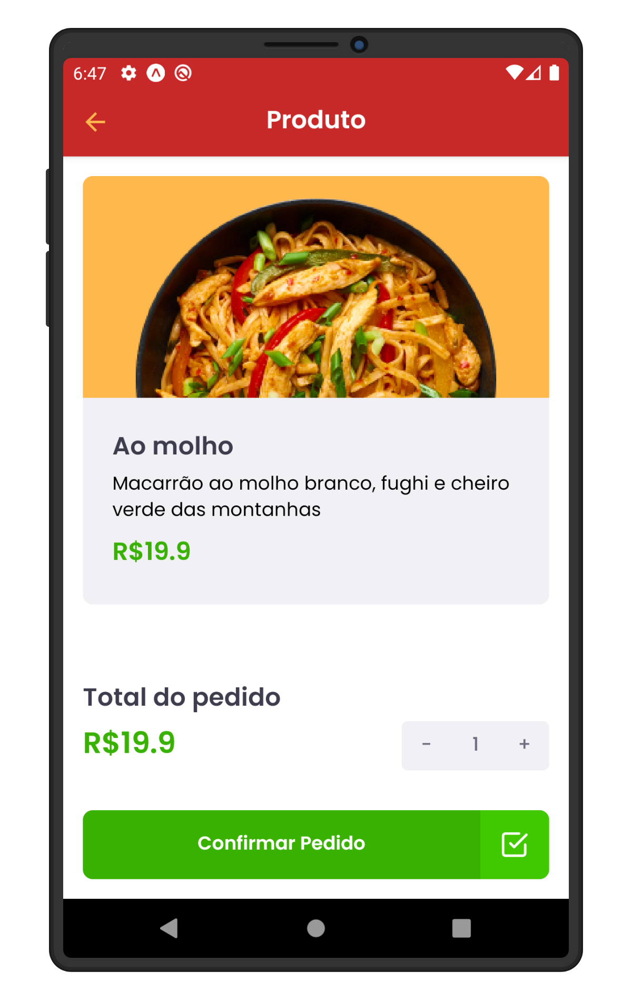
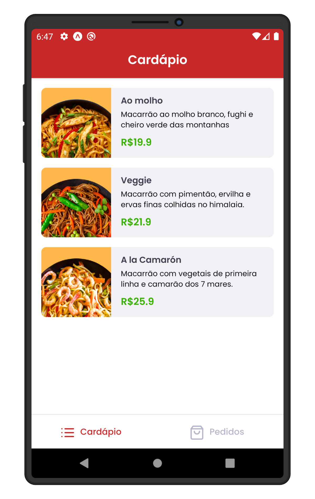
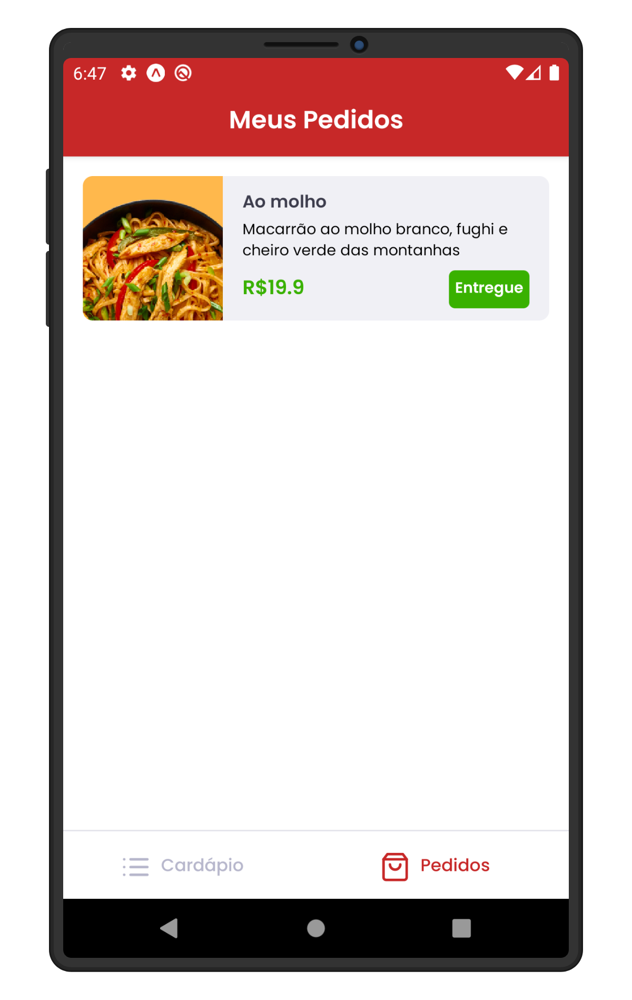
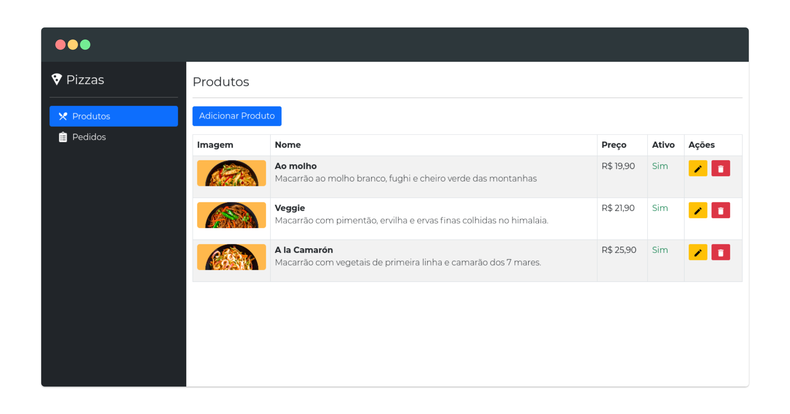
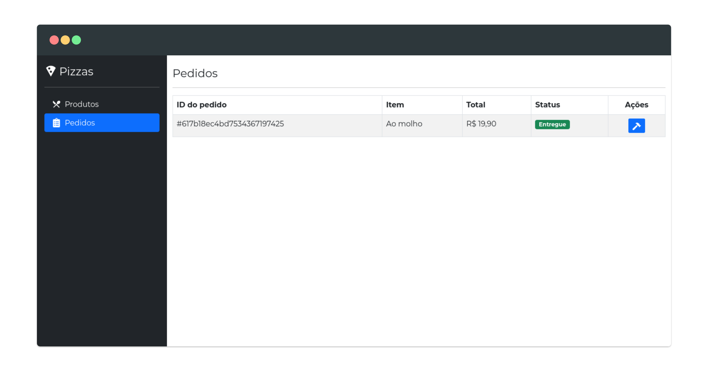

# Pizzaria 👨‍🍳

Pequeno protótipo simulando o fluxo de pedidos em uma pizzaria 😋

<p>
  
  
  
</p>




## 🚀 Tecnologias

- [React](https://pt-br.reactjs.org/)
- [Context API](https://pt-br.reactjs.org/docs/context.html)
- [React Bootstrap](https://react-bootstrap.github.io/)
- [SweetAlert](https://sweetalert2.github.io/)
- [React Hook Form](https://react-hook-form.com/get-started)
- [Yup](https://github.com/jquense/yup)
- [Typescript](https://www.typescriptlang.org/)
- [Axios](https://github.com/axios/axios)
- [Sass](https://sass-lang.com/)
- [React Native](https://reactnative.dev/)
- [Expo](https://docs.expo.dev/)

## ✨ Features

- 📂 Compartilhamento de dados globais utilizando a [Context API](https://pt-br.reactjs.org/docs/context.html)
- 💅 Layout feito utilizando [React Bootstrap](https://react-bootstrap.github.io/)
- 📋 Validação de formulários com [React Hook Form](https://react-hook-form.com/get-started)
- 🌐 Integração com api em tempo real utilizando [Socket.IO](https://socket.io/)

> Para acessar a api da aplicação, acesse o [repositório](https://github.com/ClodoaldoDantas/pizzaria-api)

## 🔥 Instalação

```bash
# frontend
$ yarn install
$ yarn start

# mobile
$ yarn install
$ expo start
```

## 💻 Demo

- [Dashboard](https://clodoaldodantas.github.io/pizzaria/)

> ⚠️ atenção: O aplicativo mobile ainda não está disponível para produção.

## 📝 Licença

Este projeto está sob a licença MIT. Veja o arquivo [LICENSE](LICENSE) para mais detalhes.
